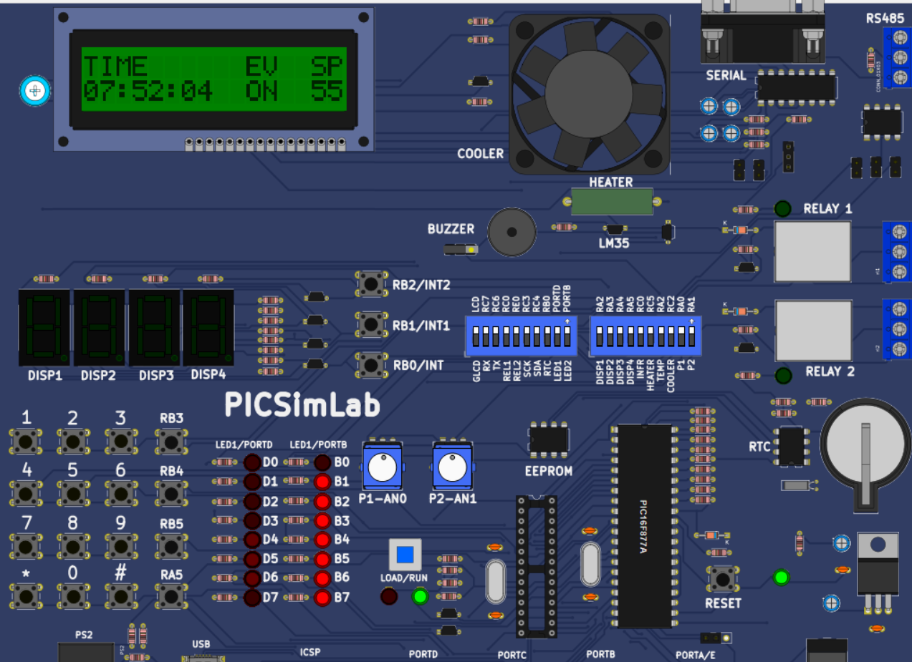

# 🚗 Car Black Box System (Embedded Firmware Project)

## Overview
The Car Black Box System is an embedded system designed to record important vehicle data such as speed, events, and time. It works similar to an aircraft black box and helps in accident analysis and vehicle monitoring.

---

## Development Tools
- Simulation: PICSimLab
- IDE: MPLAB X IDE
- Language: Embedded C
- Compiler: XC8

---

## Objectives
- Record real-time vehicle data
- Store event-based logs
- Maintain timestamped records
- Enable data retrieval for analysis
- Ensure reliable system operation

---

## Features
- Real-Time Clock (RTC) for time tracking
- EEPROM for data storage
- CLCD display (16x2 / 16x4)
- Push button user interface
- Event detection (ignition, braking, speed change)
- Circular buffer for continuous logging
- UART communication for log retrieval

---

## System Architecture

### 1. Application Layer
- Event detection
- Menu handling
- Data logging

### 2. Driver Layer
- EEPROM driver
- UART driver
- RTC driver
- CLCD driver
- Switch driver

### 3. Hardware Layer
- Microcontroller (PIC)
- Sensors (optional)
- Display and communication modules

---

## Hardware Requirements
- PIC Microcontroller
- CLCD Display (16x2 or 16x4)
- RTC Module (DS1307 / DS3231)
- EEPROM (internal/external)
- Push buttons
- UART to USB converter
- 5V power supply

---

## Software Requirements
- MPLAB X IDE
- XC8 Compiler
- PICSimLab
- Serial Terminal (PuTTY / Tera Term)

---

## Simulation Setup

### PICSimLab Simulation

---

## Functional Description

### Event Logging
The system records:
- Ignition ON/OFF
- Speed changes
- Braking events
- Collision detection

Each event includes:
- Timestamp (HH:MM:SS)
- Event type
- Speed value

---

### Display Interface
- Shows current time and event
- Menu-based navigation
- Displays latest logs

---

### Data Retrieval
- Logs are transmitted via UART
- Can be viewed on serial terminal
- Used for analysis after events

---

## Working Flow
1. Power ON system
2. Initialize peripherals
3. Display welcome message
4. Monitor events continuously
5. Store logs in EEPROM
6. View logs via display or UART

---

## Sample Data Format

| Time     | Event        | Speed |
|----------|-------------|-------|
| 10:23:12 | Ignition ON | 0 km/h |
| 10:25:30 | Speed Up    | 45 km/h |
| 10:26:05 | Brake       | 20 km/h |

---

## Future Enhancements
- GPS integration
- SD card storage
- Wireless communication (Bluetooth/WiFi)
- Mobile app interface
- Cloud data storage

## Project Status
Completed

---

## Author
Rahul Suresh Mali  
Mechatronics Engineer  

---

## License
This project is for educational purposes.
